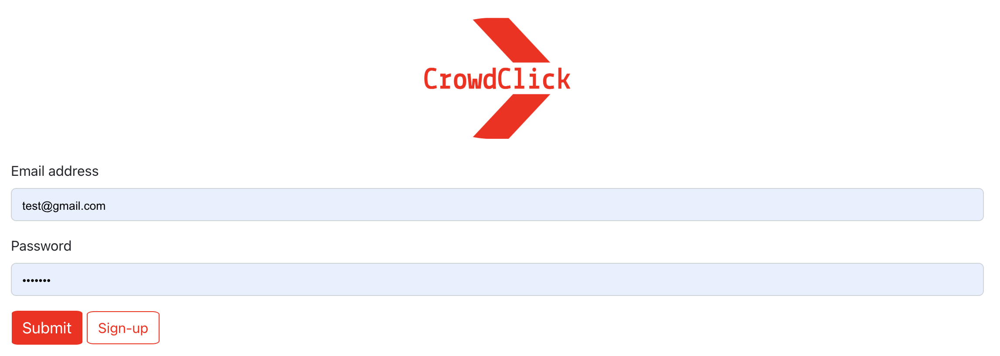
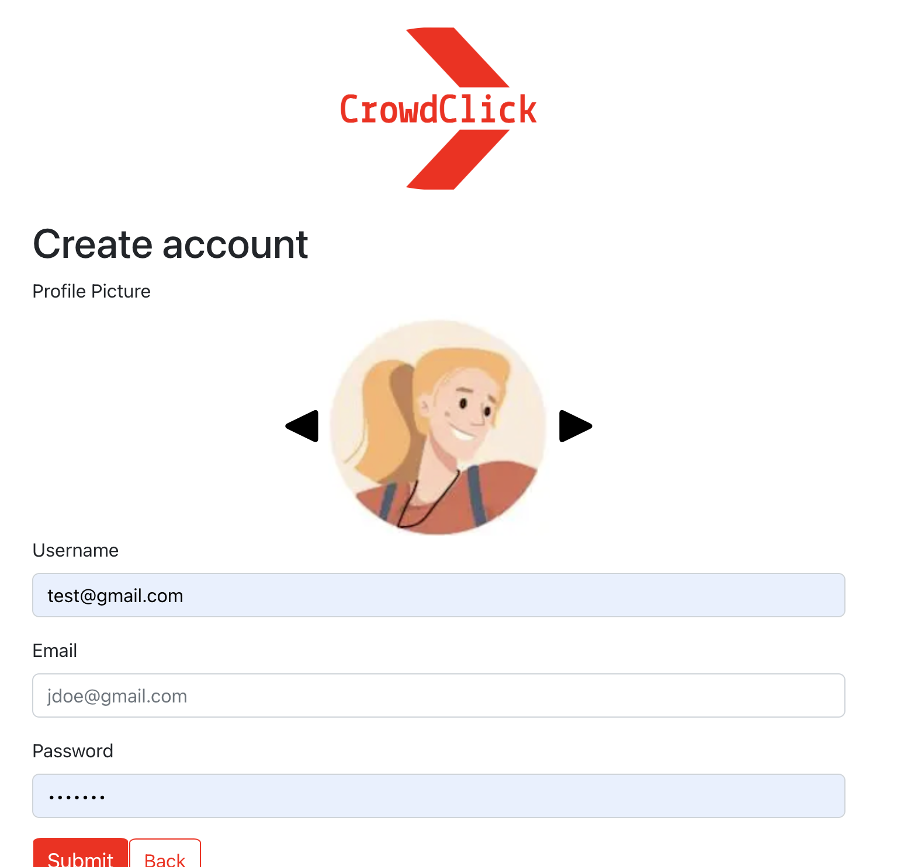
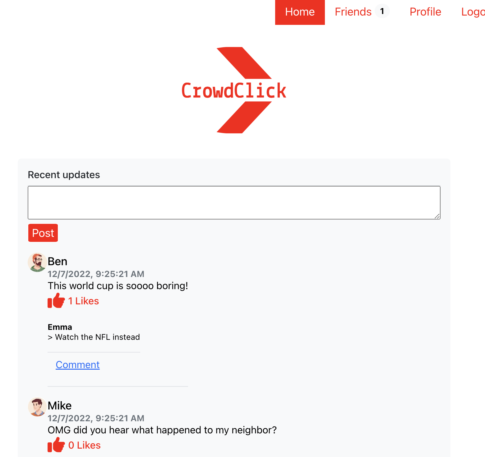
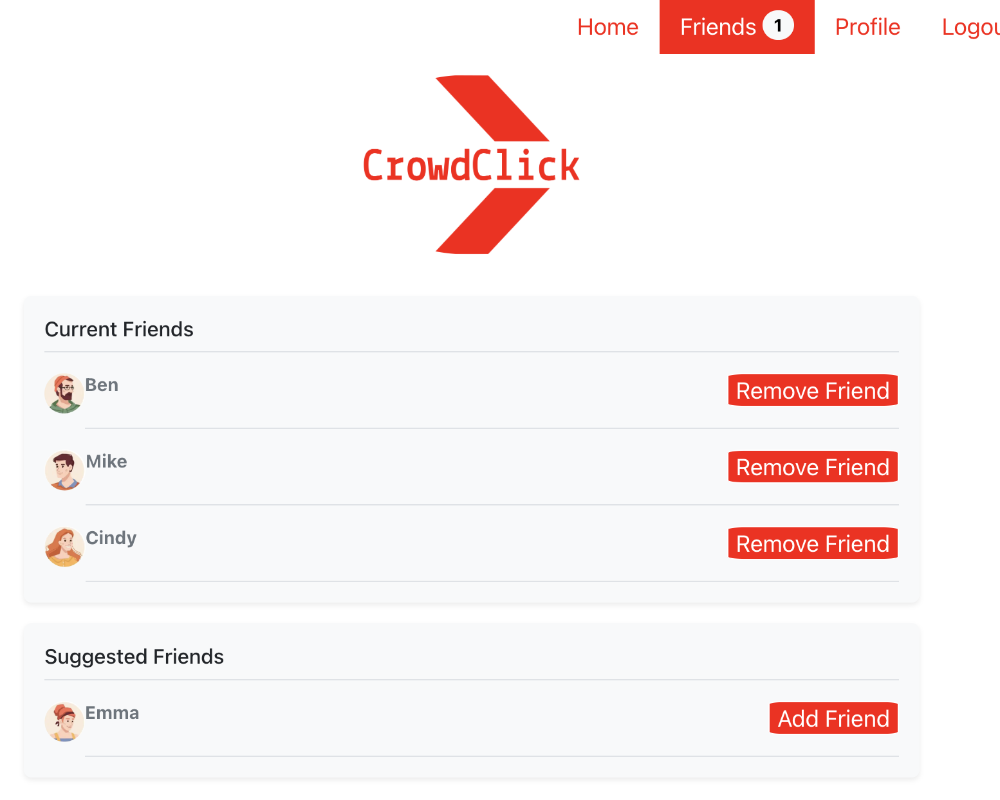
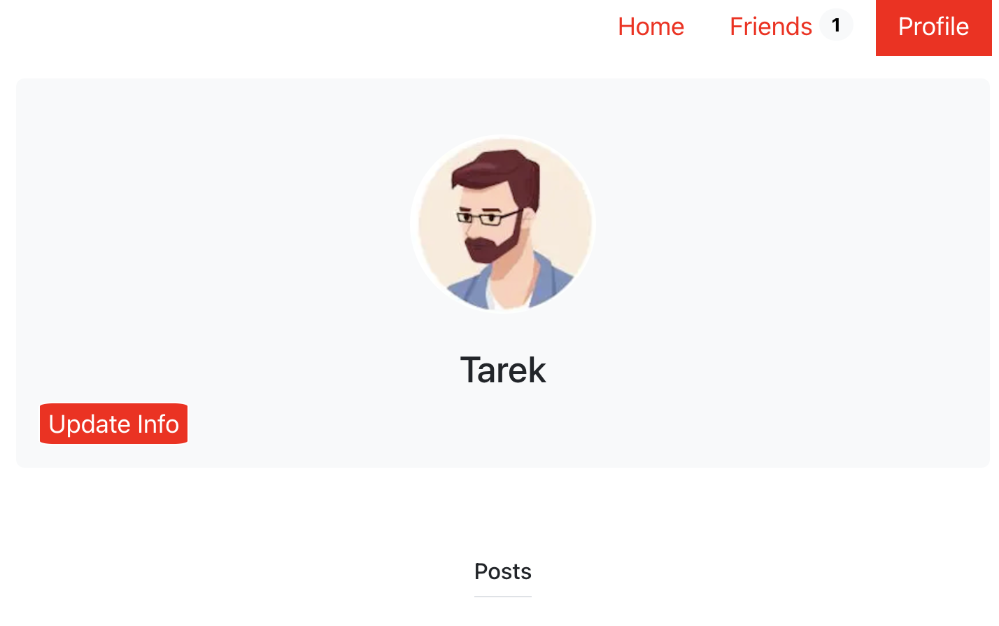

# CrowdClick

## Description

CrowdClick is a social media application meant for communication between users. CrowdClick allows users to post to their feed, add other users as friends, and view other user's posts and profiles. User's are required to either log in or create an account through a form submission. After having logged in, user's can then access the homepage where posts and comments can be submitted and viewed.

The web application features a dynamically updated UI using React. It also uses Express.js on the backend and MongoDB to store user data. My motivation behind building CrowdClick was to create a fun way for friends to connect with each other as well as showcasing my React full-stack coding ability.

## Demo

Here is a demo video for your convenience:
https://drive.google.com/file/d/1GatUTCLsZd-ZFJuWcMZC4c2Nxh0eflRh/view

## Seed sample logins:

Username: test@gmail.com
Password: password

Username: test2@gmail.com
Password: password

## Usage

CrowdClick is easy to use. First, the user is presented with a signin page where they are prompted to sign in or create an account requiring their first and last name, email, and a password.

Once signed in, the user is brought to the homepage where they are able to view, like, create, and submit posts. User's can also comment under other user's posts by pressing the "comment" button. At the top of the page, there is a navigation bar with links to other pages including the homepage, a friends page, the user's profile page, and a "logout" button which brings the user back to the "signin" page. At the friends page, the user can view suggested friends with the option to follow them.

Lastly, user's can view their profile by clicking the "profile" button in the navigation bar. Once directed to the profile page, user's can view their profile image, name and posts.

## Signin/Signup Pages:

## Homepage:

## Friends Page:

## Profile Page:

## Links

The following GitHub repo url is:
https://github.com/tarekmn/crowdclick-react-social-media

In addition, here is deployted url:
https://crowdclick-production.up.railway.app/login

## License

MIT License

Copyright (c) 2022

Permission is hereby granted, free of charge, to any person obtaining a copy
of this software and associated documentation files (the "Software"), to deal
in the Software without restriction, including without limitation the rights
to use, copy, modify, merge, publish, distribute, sublicense, and/or sell
copies of the Software, and to permit persons to whom the Software is
furnished to do so, subject to the following conditions:

The above copyright notice and this permission notice shall be included in all
copies or substantial portions of the Software.

THE SOFTWARE IS PROVIDED "AS IS", WITHOUT WARRANTY OF ANY KIND, EXPRESS OR
IMPLIED, INCLUDING BUT NOT LIMITED TO THE WARRANTIES OF MERCHANTABILITY,
FITNESS FOR A PARTICULAR PURPOSE AND NONINFRINGEMENT. IN NO EVENT SHALL THE
AUTHORS OR COPYRIGHT HOLDERS BE LIABLE FOR ANY CLAIM, DAMAGES OR OTHER
LIABILITY, WHETHER IN AN ACTION OF CONTRACT, TORT OR OTHERWISE, ARISING FROM,
OUT OF OR IN CONNECTION WITH THE SOFTWARE OR THE USE OR OTHER DEALINGS IN THE
SOFTWARE.
